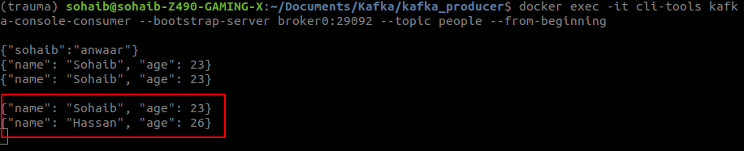
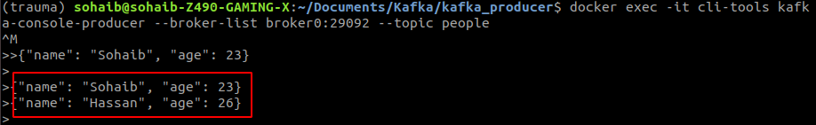
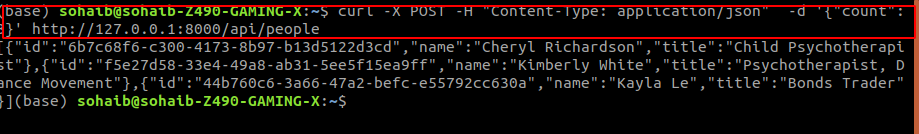
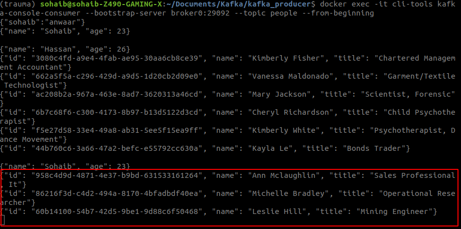

# Producing Message to Kafka Using CLI


## Prerequisites
1. **kafka-installtions-and-kafka-topics:** https://medium.com/dev-genius/kafka-installtions-and-kafka-topics-f0b7c81754d8
2. **kafka-with-python-fast-api:** https://medium.com/dev-genius/kafka-with-python-fast-api-b1622eb7f9d0


## Initlize Kafka
```bash
docker-compose up -d
```
## Creating topic
we will create a topic named `people` with 2 partition and 1 replica
```bash
docker exec -it cli-tools kafka-console-consumer --bootstrap-server broker0:29092 --topic people --from-beginning
```
## Creating Producer
```bash
docker exec -it cli-tools kafka-console-producer --broker-list broker0:29092 --topic people
```


## Initilzeing Consumer
Initilzeing Consumer so that when ever producer produce message it will be consumed by consumer
```bash
docker-compose exec broker kafka-console-consumer --bootstrap-server localhost:9092 --topic test --from-beginning
```

## Producing Message
```bash
{"name": "Sohaib", "age": 23}
{"name": "Hassan", "age": 26}
```

## Consuming Message
```bash
{"name": "Sohaib", "age": 23}
{"name": "Hassan", "age": 26}
```
So when we produce message using producer it will be consumed by consumer in no time and we can see the message in consumer.

# Now lets try to produce message using python
First lets create an env file while will help us in keeping the kafka server settings

## Steps to start
1. Create a virtual environment
```bash
# I am using conda so
conda create -n kafka python=3.8
```
2. Install the requirements

```bash
# kafka-python==2.0.2
# fastapi[all]== 0.75.1
# python-dotenv==0.20.0
# Faker==13.3.4
pip install -r requirements.txt
```

3. Create a `.env` file

```bash
BOOTSTRAP_SERVER="localhost:9092,localhost:9093,localhost:9094"
TOPIC_NAME="people.basic.python"
TOPIC_PARTITION=3
TOPIC_REPLICA=3
```
4. Make `main.py` executable
```python
# Import Libraries
import os
import uuid
from typing import List

from dotenv import load_dotenv
from fastapi import FastAPI
from faker import Faker
from kafka import KafkaAdminClient
from kafka.admin import NewTopic
from kafka.errors import TopicAlreadyExistsError
from kafka.producer import KafkaProducer
```
Make Startup function
```python
# Startup Function
@app.on_event('startup')
async def startup_event():
  """_summary_: Create the topic if it doesn't exist
  """
  # Getting the boot strap servers from the environment
  client = KafkaAdminClient(bootstrap_servers=os.environ['BOOTSTRAP_SERVER'])
  try:
    # Creating the topic
    topic = NewTopic(name=os.environ['TOPIC_NAME'],
                    num_partitions=int(os.environ['TOPIC_PARTITION']),
                    replication_factor=int(os.environ['TOPIC_REPLICA']))
    client.create_topics([topic])
  except TopicAlreadyExistsError as e:
    print(e)
  finally:
    client.close()
```
Create a function to produce message
```python
def make_producer():
  """_summary_: Create a Kafka producer
  """
  producer = KafkaProducer(bootstrap_servers=os.environ['BOOTSTRAP_SERVER'])
  return producer
```
Create api to produce message
```python

@app.post('/api/people', status_code=201, response_model=List[Person])
async def create_people(cmd: CreatePeopleCommand):
  """_summary_: Create a list of people
  """
  people: List[Person] = []
  # Creating the Fake people
  faker = Faker()
  # Creating the producer
  producer = make_producer()
  # Creating the people and sending them to the topic
  for _ in range(cmd.count):
    person = Person(id=str(uuid.uuid4()), name=faker.name(), title=faker.job().title())
    people.append(person)
    producer.send(topic=os.environ['TOPIC_NAME'],
                key=person.title.lower().replace(r's+', '-').encode('utf-8'),
                value=person.json().encode('utf-8'))
  # Closing the producer
  producer.flush()

  return people
```
After doing all this we can run the server using
```bash
uvicorn main:app --reload
```
Now we can produce message using the api
```bash
curl -X POST "http://localhost:8000/api/people" -H "accept: application/json" -H "Content-Type: application/json" -d "{\"count\": 3}"
```


Now we can see the message in the consumer



# Conclusion
In this blog you have learned how to make a producer with the help of python and terminal and read the message using consumer. You can also produce message using api and read the message using consumer. You can also check the github repo for the code.

# References
1. https://kafka.apache.org/quickstart
2. https://github.com/SohaibAnwaar/Produce-Messages-To-Kafka

# Author 
* Sohaib Anwaar  : https://www.sohaibanwaar.com
* gmail          : sohaibanwaar36@gmail.com
* linkedin       : [Have Some Professional Talk here](https://www.linkedin.com/in/sohaib-anwaar-4b7ba1187/)
* Stack Overflow : [Get my help Here](https://stackoverflow.com/users/7959545/sohaib-anwaar)
* Kaggle         : [View my master-pieces here](https://www.kaggle.com/sohaibanwaar1203)
* Github         : [View my code here](https://github.com/SohaibAnwaar)